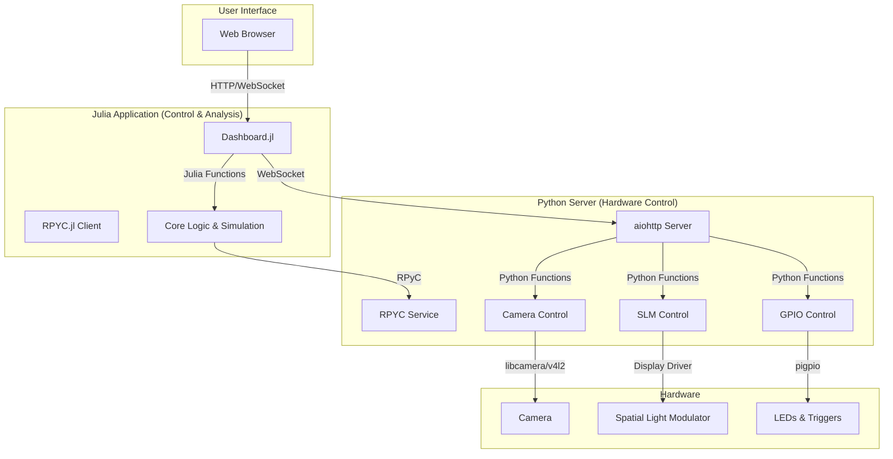

# OpenFinch Project Architecture

## Overview

The OpenFinch project is a sophisticated system for computational imaging, combining a high-level Julia application for control and a Python server for direct hardware interaction. This dual-language architecture leverages Julia's strengths in numerical computing and Python's extensive hardware support libraries. The system is designed to control a camera and a Spatial Light Modulator (SLM) in a synchronized manner, enabling advanced optical experiments.

## Components

The project is divided into two main components: the Julia application and the Python server.

### Julia Application (`OpenFinch.jl`)

The Julia application serves as the user-facing control interface and the primary environment for data analysis and simulation.

-   **`src/Dashboard.jl`**: Provides a web-based graphical user interface (GUI) built with `JSServe.jl`. This allows users to control the hardware, view live camera feeds, and adjust parameters in real-time from a web browser.
-   **`src/RPYC.jl`**: Implements the client-side logic for Remote Python Call (RPyC). This module is crucial for the communication between the Julia application and the Python server, enabling Julia to execute Python code on the remote machine where the hardware is connected.
-   **`src/SLM.jl`**: Contains functions for controlling the Spatial Light Modulator. It uses the RPyC connection to send commands to the Python server, which then displays images or patterns on the SLM.
-   **`src/CameraControl.jl`**: Manages low-level camera and hardware synchronization. It uses `PythonCall.jl` to interface with the `pigpio` library for precise GPIO-based triggering of the camera and other components.

### Python Server (`OpenFinchServer`)

The Python server runs on the machine directly connected to the hardware (likely a Raspberry Pi) and exposes control functionality to the Julia application.

-   **`web/server.py`**: An `aiohttp` web server that handles communication with the Julia client. It uses WebSockets for real-time, bidirectional communication, streaming camera frames to the client and receiving control commands.
-   **`camera/`**: A package for camera control. It includes modules for different camera backends like `picamera2` and `v4l2`, providing a consistent interface for capturing images.
-   **`gpio/`**: Contains modules for controlling General-Purpose Input/Output (GPIO) pins. This is used for tasks like triggering the camera, controlling LEDs, and synchronizing different hardware components.

## System Architecture Diagram

The following diagram illustrates the relationship between the different components of the OpenFinch system.

